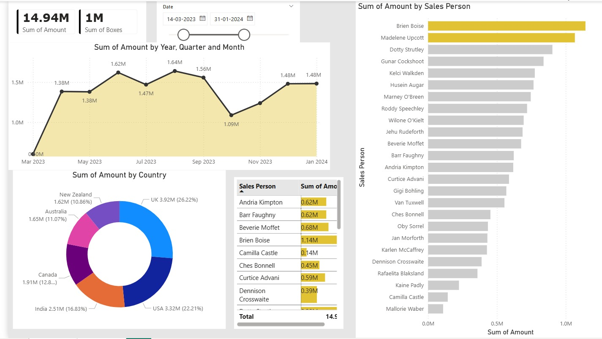

# Sales & Performance Analytics Dashboard

An interactive **Power BI** dashboard analyzing chocolate sales data across multiple countries, products, and sales personnel. Built to demonstrate data transformation, DAX measures, and visual storytelling for business decision-making.

## Dashboard Preview

### Page 1 — Boxes Shipped Overview


**Key visuals:**
- **Sum of Boxes by Country** — Bar chart comparing shipment volumes across Canada, UK, USA, India, Australia, and New Zealand
- **Average Boxes by Sales Person** — Horizontal bar chart ranking all sales reps by average boxes shipped
- **Date Range Slicer** — Filter data between Jan 2023 and Sep 2024
- **Product Filter** — Slicer for chocolate product types (Dark Bites, Dark Bars, After Nines, Almond Choco, etc.)
- **KPI Card** — 49K total boxes shipped

### Page 2 — Revenue & Amount Analysis


**Key visuals:**
- **Sum of Amount by Year, Quarter & Month** — Area chart showing revenue trends (Mar 2023 – Jan 2024), peaking at 1.64M in Jul 2023
- **Sum of Amount by Country** — Donut chart with revenue distribution: UK (26.22%), USA (22.21%), India (16.83%), Canada (12.8%), Australia (11.07%), New Zealand (10.86%)
- **Sum of Amount by Sales Person** — Horizontal bar chart highlighting top performers (Brien Boise leading at ~1.14M)
- **Sales Person Table** — Detailed breakdown with conditional formatting on revenue figures
- **KPI Cards** — 14.94M total revenue, 1M total boxes
- **Date Range Slicer** — Interactive date filtering

## Data & Metrics

| Metric | Value |
|--------|-------|
| Total Revenue | 14.94M |
| Total Boxes Shipped | ~49K (Page 1) / 1M (Page 2 full range) |
| Countries Covered | 6 (Canada, UK, USA, India, Australia, New Zealand) |
| Sales Personnel | 24 |
| Date Range | Jan 2023 – Sep 2024 |
| Product Categories | 10+ chocolate product types |

## Features

- **Interactive date range slicers** with drag-to-filter timeline
- **Cross-filtering** between visuals — click a country to filter sales reps, and vice versa
- **Product-level drill-down** via checkbox slicer
- **DAX measures** for Sum of Boxes, Sum of Amount, and averages
- **Conditional formatting** on revenue table for quick visual comparison
- **Multi-page layout** separating volume analysis (Page 1) from revenue analysis (Page 2)

## Tools & Techniques

- **Power BI Desktop** — Report design and publishing
- **DAX (Data Analysis Expressions)** — Custom measures and calculated columns
- **Power Query** — Data transformation and cleaning
- **Data Modeling** — Relationships between fact and dimension tables

## How to Open

1. Download the `.pbix` file or unzip `First Power BI report.zip`
2. Open with [Power BI Desktop](https://powerbi.microsoft.com/desktop/) (free)
3. Interact with slicers and visuals to explore the data

## Project Structure

```
├── README.md
├── First Power BI report.zip    # Power BI report package
├── screenshots/
│   ├── page1-boxes-by-country.jpg
│   └── page2-sales-amount-analysis.jpg
├── DataModel                     # Embedded data model
├── Report/
│   └── Layout                   # Report layout definition
└── Metadata                     # Report metadata
```

## License

MIT
